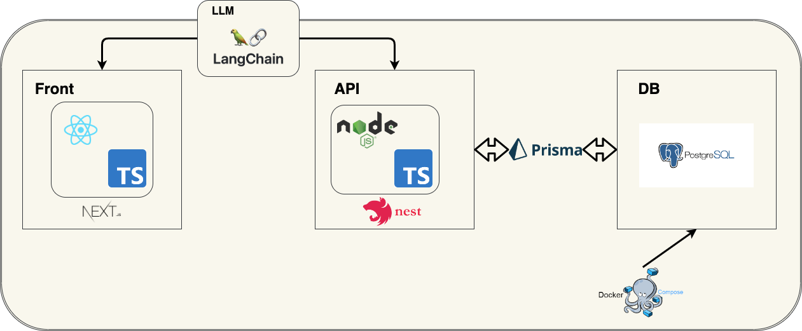

## 環境構築
dockerで環境を用意しているので下記で起動してください
```bash
docker compose up -d
```

## 構成


## ベクトルデータの追加
1. api/dataフォルダに読み込みたいファイルを配置(csv, pdf, docx対応)
2. 拡張子ごとに各コマンドを入力
    - csv 
    ```bash
    yarn memo:install ./data/{1で配置したファイル名}
    ```
    - pdf
    ```bash
    yarn memo:install:pdf ./data/{1で配置したファイル名}
    ```